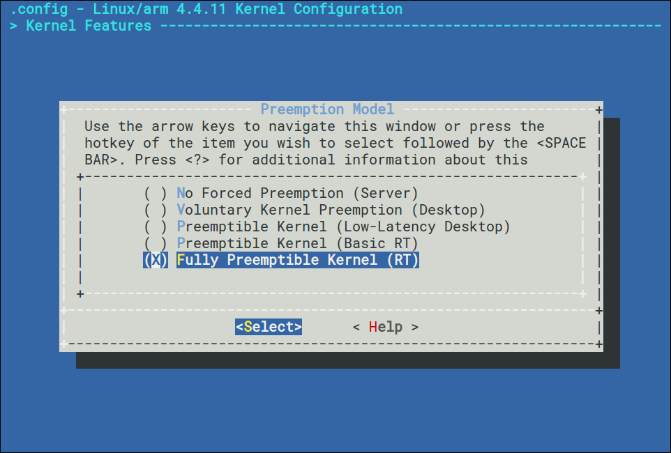
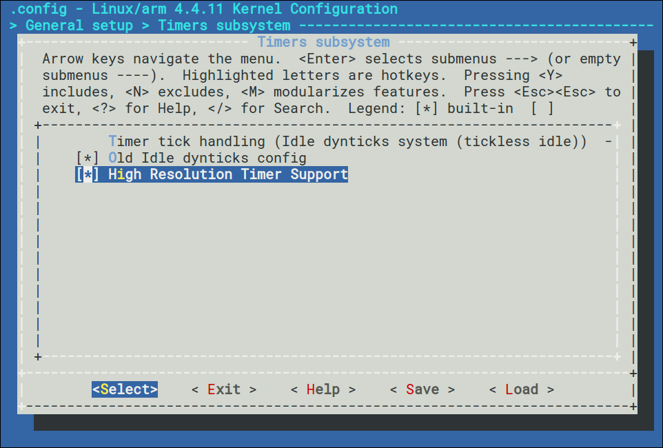

## Overview

The following steps are required to get a basic Machinekit / EtherCAT system on the Raspberry PI 3 Model B:

* Download and boot into a Raspbian 8.0 system
* Build and install a Raspberry Pi RT Preempt Linux Kernel
* Build and install IgH EtherCAT master
* Setup Machinekit

### Download and boot into a Raspbian 8.0 system

* Download and install [Raspbian 8.0 onto a microSD card](https://www.raspberrypi.org/downloads/).

### Build and install a Raspberry Pi RT Preempt Linux Kernel

#### Download Raspberry Pi Kernel Sources

```bash
cd /opt
git ls-remote --heads https://github.com/raspberrypi/linux.git # show the branches
git clone -b 'rpi-4.4.y' --single-branch --depth 1 https://github.com/raspberrypi/linux.git
```

#### Patch Kernel with RT Preempt Patch

Next, patch the kernel with the RT Preempt patch. Choose the patch matching
your kernel version. To this end, have a look at the Makefile. VERSION,
PATCHLEVEL, and SUBLEVEL define the kernel version. At the time of writing
this tutorial, the latest kernel was version 4.4.9. Patches for older kernels
can be found in folder "older".

```bash
cd /opt/linux
wget https://www.kernel.org/pub/linux/kernel/projects/rt/4.4/patch-4.4.9-rt17.patch.gz
zcat patch-4.4.9-rt17.patch.gz | patch -p1
find -iname "*.rej" # check for rejected patches
```

#### Configure the Kernel

Next, configure the kernel for using RT Preempt.

For Raspberry Pi 2/3 Model B, execute these commands:
```bash
export KERNEL=kernel7
make bcm2709_defconfig
```

An alternative way is to export the configuration from a running Raspberry Pi:
```bash
sudo modprobe configs
zcat /proc/config.gz > .config
```

Next, prepare the system for kernel building:
```bash
sudo apt -y install bc libncurses-dev
```

Then, you can start to configure the kernel:
```bash
make -j$(nproc) menuconfig
```

In the kernel configuration, enable the following settings:

  * ```CONFIG_PREEMPT_RT_FULL```: Kernel Features → Preemption Model (Fully Preemptible Kernel (RT)) → Fully Preemptible Kernel (RT)

  

  * Enable ```HIGH_RES_TIMERS```: General setup → Timers subsystem → High Resolution Timer Support (Actually, this should already be enabled in the standard configuration.)

  

#### Build the Kernel

```bash
cd /opt/linux
make -j$(nproc) zImage
make -j$(nproc) modules
make -j$(nproc) dtbs
sudo make modules_install
```

#### Install Kernel Image, Modules, and Device Tree Overlay files

```bash
sudo su -
cp -rpv /boot /boot.bak
cd /opt/linux
export KERNEL=kernel7 # For Raspberry Pi 2/3 Model B
./scripts/mkknlimg ./arch/arm/boot/zImage /boot/$KERNEL.img
cp -pv  ./arch/arm/boot/dts/*.dtb /boot
cp -rpv ./arch/arm/boot/dts/overlays /boot
```

```bash
sudo nano /boot/cmdline.txt
```

Add the following option:
```
sdhci_bcm2708.enable_llm=0
```

Reboot:
```bash
sudo shutdown -r 1; exit
```

See also: http://www.frank-durr.de/?p=203

#### Latency Evaluation

For sure, you want to know the latency bounds achieved with the RT Preempt patch. To this end, you can use the tool cyclictest with the following test case:

* 100 % load generated by running the following commands in parallel:
  * On the Pi:
  ```bash
pi@raspberrypi ~$ cat /dev/zero > /dev/null
  ```
  * From another host:
  ```bash
user@host ~$ sudo ping -i 0.01 raspberrypi
  ```

```bash
cd /opt
git clone git://git.kernel.org/pub/scm/utils/rt-tests/rt-tests.git
cd rt-tests/
make all
sudo cp ./cyclictest /usr/bin/
```

On a Raspberry Pi 3 model B, I got the following results:

With Linux 4.4.11-rt17v7+ (my custom built kernel as described above):

```bash
$ uname -a
Linux raspberrypi 4.4.11-rt17-v7+ #1 SMP PREEMPT RT Sun May 29 12:59:15 UTC 2016 armv7l GNU/Linux
$ sudo cyclictest -t1 -p 80 -n -i 10000 -l 10000
# /dev/cpu_dma_latency set to 0us
policy: fifo: loadavg: 0.46 0.31 0.19 1/190 8964

T: 0 ( 8600) P:80 I:10000 C:  10000 Min:     15 Act:   17 Avg:   21 Max:      86
```

With Linux 4.4.4-rt9-v7+ from [linux-image-rpi2-rt](http://www.machinekit.io/docs/index-getting-started/#rt-preempt-realtime-kernel-raspberry-pi):

```bash
$ uname -a
Linux raspberrypi 4.4.4-rt9-v7+ #7 SMP PREEMPT RT Mon Mar 7 14:53:11 UTC 2016 armv7l GNU/Linux
$ sudo cyclictest -t1 -p 80 -n -i 10000 -l 10000
# /dev/cpu_dma_latency set to 0us
policy: fifo: loadavg: 1.50 1.01 0.71 3/197 5368           

T: 0 ( 3112) P:80 I:10000 C:  10000 Min:     13 Act:   17 Avg:   25 Max:      86
```

With some more tests, the worst case latency sometimes reached about 127 microseconds. Adding a safety margin, this should be safe for cycletimes of 1 ms.

For comparison see:

* https://rt.wiki.kernel.org/index.php/Cyclictest
* https://docs.emlid.com/navio/Downloads/Real-time-Linux-RPi2
* https://github.com/machinekit/machinekit/issues/792

### Build and install IgH EtherCAT master

```bash
git clone https://github.com/koppi/ec-debianize
cd ec-debianize
git checkout for-sittner
debian/configure `uname -r`
dpkg-checkbuilddeps
debuild -uc -us
```
In case you see an [error](https://github.com/sittner/ec-debianize/issues/2) during the package build process, do as a workaround:
```bash
touch master/soe_errors.c
debuild -uc -us -nc
```

Install the etherlabmaster Debian package:
```bash
sudo dpkg -i ../etherlabmaster*deb
```

Next, edit:
```bash
sudo vi /etc/default/sysconfig/ethercat
```
Add your ethX MAC address, given by ```ifconfig eth0```:
```
MASTER0_DEVICE="b8:27:XX:XX:XX:XX" # your MAC address
DEVICE_MODULES="generic" #  the IgH EtherCAT master generic driver
```

Start the EtherCAT master:
```bash
sudo systemctl start ethercat.service
sudo systemctl status ethercat.service
● ethercat.service - EtherCAT Master Kernel Modules
   Loaded: loaded (/usr/lib/systemd/system/ethercat.service; enabled)
   Active: active (exited) since Mon 2016-05-30 18:53:20 UTC; 4s ago
  Process: 10020 ExecStop=/usr/sbin/ethercatctl stop (code=exited, status=0/SUCCESS)
  Process: 10030 ExecStart=/usr/sbin/ethercatctl start (code=exited, status=0/SUCCESS)
 Main PID: 10030 (code=exited, status=0/SUCCESS)
```

List the EtherCAT devices connected to the Raspberry PI 3:
```bash
ethercat slaves
0  0:0  PREOP  +  EK1100 EtherCAT-Koppler (2A E-Bus)
1  0:1  PREOP  +  EL2004 4K. Dig. Ausgang 24V, 0.5A
2  0:2  PREOP  +  EL2004 4K. Dig. Ausgang 24V, 0.5A
```

If the above worked, enable the service during system boot:
```bash
sudo systemctl enable ethercat.service
```

### Setup Machinekit

The Machinekit setup is pretty straight forward – just compile Machinekit from source or install the armhf Debian packages provided by http://deb.machinekit.io/debian/dists/raspbian/ .

### ChangeLog

* 2016-05-30 Initial version.
* 2016-06-16 Add info about Machinekit setup.

