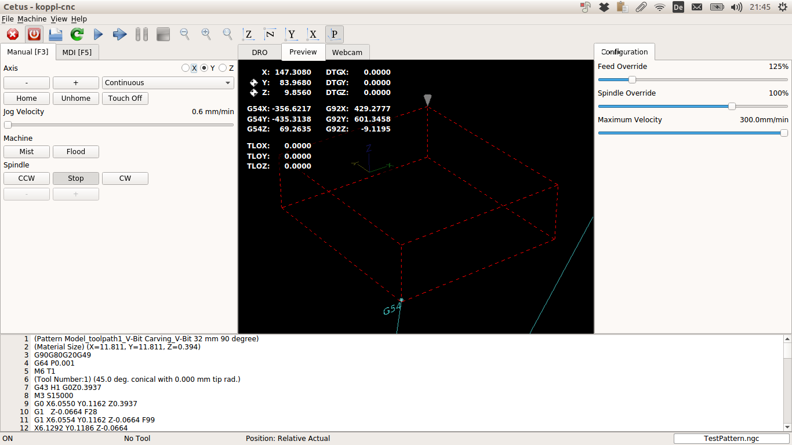
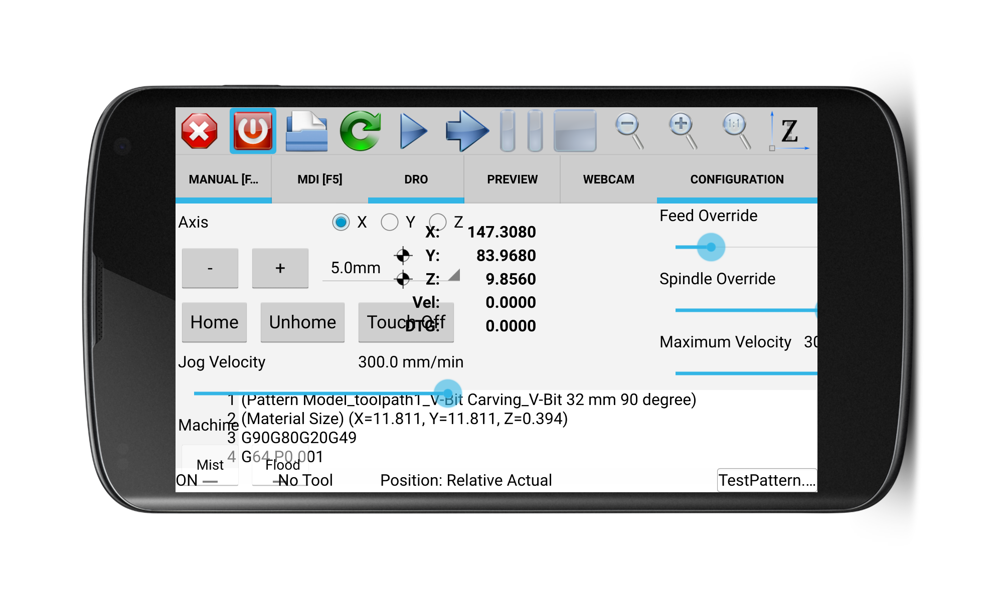

# Machinekit / Debian Jessie auf Thinkpad X200

### ChangeLog

* 2016-04-19 Erfolgreicher Test von [MachinekitClient](https://github.com/strahlex/MachinekitClient).

  [Machinekit](https://github.com/machinekit/machinekit), [QtQuickVcp](https://github.com/strahlex/QtQuickVcp), [Cetus](https://github.com/strahlex/Cetus) und [mklauncher](https://github.com/machinekit/machinekit/blob/master/src/machinetalk/mklauncher/mklauncher.py) auf [Debian/Jessie](https://www.debian.org/releases/jessie/) x64 ([Thinkpad X200](http://thinkwiki.de/X200)).

  [MachinekitClient](https://github.com/strahlex/MachinekitClient) auf [Ubuntu 16.04](https://wiki.ubuntu.com/XenialXerus/ReleaseNotes) x64 ([Thinkpad X220](http://thinkwiki.de/X220)):

  

  [Machinekit App](https://play.google.com/store/apps/details?id=io.machinekit.appdiscover) auf [Android 5.0](https://www.android.com/versions/lollipop-5-0/) ([Nexus4](https://en.wikipedia.org/wiki/Nexus_4)):

  

  Config-Dateien, siehe: https://github.com/koppi/mk/commits/mklauncher

* 2015-05-30 [aktuelle Version basiert auf Debian/Jessie](https://github.com/koppi/mk/blob/master/Machinekit-Xenomai-Thinkpad-X200.md)
* 2015-05-26 [  ältere Version basiert auf Debia/Wheezy](https://github.com/koppi/mk/blob/daa3fd64a0b2b61933cdda100c8679dcee8232cb/Machinekit-Xenomai-Thinkpad-X200.md)

### Übersicht

Übersicht Steuerung:

 1. IBM Thinkpad X200 mit Debian Jessie / Linux 3.8.1 / Machinekit 0.1 / Xenomai 2.6.4
 2. 24VDC 50W Netzteil
 3. Beckhoff EtherCAT Komponenten
 4. SSR-40 DA Solid State Relay Modul (– wird momentan nicht verwendet, stattdessen die EL2622-Klemme)
 5. Stromversorgung Kress / Staubsauger

Übersicht Steuerungselektronik:

 1. Stromversorgung 24V von Netzteil
 2. Ethernet-Kabel vom Thinkpad zum EK1100 (EtherCAT-Koppler)
 3. Ausgang 1 vom EL2004 zum Solid State Relay Modul
 4. Eingang 1 vom EL1004 zum Not-Aus Schalter
 5. Eingang 2 vom EL1004 zum Tastkopf
 6. 24V Versorgung von Verteilerklemme EL9184 zur Bus-Klemme EL9100
 7. 24V Versorgung Schrittmotorendstufen EL7041-1000
 8. Ausgänge Schrittmotoren

Übersicht Fräsmaschine:

 1. Kleine CNC Fräsmaschine Portal 210 x 230 x 70 - [www.flohmarkt4u.de](http://www.flohmarkt4u.de/)
 2. Nema23 Stepper Motor 57BYGH627 - Wantai
 3. Kress 1050 FME-1 Fräsmotor - EAN: 4000649061895
 4. Red Sign Emergency Stop Push Button - eBay
 5. Eingang Tastkopf für Werkzeuglängensensor
 6. OBI LUX Maschinen Schraubstock 60x65mm - EAN: 4007871165254

### Videos

* https://www.youtube.com/watch?v=0LI99cNjB_c
* https://www.youtube.com/watch?v=2nGcliWefek
* https://www.youtube.com/watch?v=F3YbdD2OPRA
* https://www.youtube.com/watch?v=WRgyBxaeoAo

# Installation Machinekit / LinuxCNC

### Thinkpad X200 BIOS Einstellungen

BIOS auf Werkseinstellungen zurücksetzen:


## Installation Debian Jessie

ISO-Datei herunterladen:
```bash
$ wget -c http://cdimage.debian.org/cdimage/unofficial/non-free/cd-including-firmware/8.0.0-live+nonfree/amd64/iso-hybrid/debian-live-8.0.0-amd64-gnome-desktop+nonfree.iso
```
bzw.:
```bash
$ wget -c http://cdimage.debian.org/cdimage/unofficial/non-free/cd-including-firmware/archive/8.0.0-live+nonfree/amd64/iso-hybrid/debian-live-8.0.0-amd64-gnome-desktop+nonfree.iso
```
Prüfsumme berechnen und vergleichen mit [MD5SUMS](http://cdimage.debian.org/cdimage/unofficial/non-free/cd-including-firmware/8.0.0-live+nonfree/amd64/iso-hybrid/MD5SUMS):
```bash
$ md5sum debian-live-8.0.0-amd64-gnome-desktop+nonfree.iso 
7a56cc2f78f8ea90d0c78fc462f95b95  debian-live-8.0.0-amd64-gnome-desktop+nonfree.iso
```
ISO-Datei auf USB-Stick kopieren:
```bash
$ sudo dd if=debian-live-8.0.0-amd64-gnome-desktop+nonfree.iso of=/dev/sdX
```

Debian installieren und Rechner neu starten.

Im Thinkpad BIOS "Legacy USB" deaktivieren:


### GDM3 automatisches Einloggen

```bash
$ sudo -i
# sed -i "s|^#\?.*AutomaticLoginEnable.*|AutomaticLoginEnable = true|" /etc/gdm3/daemon.conf
# sed -i "s|^#\?.*AutomaticLogin .*=.*|AutomaticLogin = koppi\nTimedLoginEnable = true\nTimedLogin = koppi\nTimedLoginDelay = 0|" /etc/gdm3/daemon.conf
```

### Gnome Desktop

```bash
$ gsettings set org.gnome.desktop.background primary-color 000000
$ gsettings set org.gnome.desktop.wm.preferences titlebar-font 'Cantarell Bold 8'
$ gsettings set $gset_powr_path sleep-inactive-ac-timeout 0
$ gsettings set org.gnome.desktop.lockdown disable-lock-screen true
$ gsettings set org.gnome.settings-daemon.plugins.xrandr default-monitors-setup do-nothing
$ gsettings set org.gnome.SessionManager logout-prompt false
$ gsettings set org.gnome.desktop.interface cursor-blink false
$ gsettings set org.gnome.settings-daemon.peripherals.mouse middle-button-enabled true
$ gsettings set org.gnome.Terminal.Legacy.Settings confirm-close false
$ gsettings set org.gnome.desktop.interface enable-animations false
$ gsettings set org.gnome.settings-daemon.plugins.cursor active false
$ sudo -i
# sed -i "/title_vertical_pad/s/value=\"[0-9]\{1,2\}\"/value=\"0\"/g" \
    /usr/share/themes/Adwaita/metacity-1/metacity-theme-3.xml
```

```bash
sudo vi /etc/systemd/logind.conf
#HandleLidSwitch=suspend
HandleLidSwitch=ignore
```

```bash
$ sudo systemctl restart systemd-logind
```

### Konfiguration WLAN

```/etc/network/interfaces``` anpassen:
```ini
auto wlan0
allow-hotplug wlan0
iface wlan0 inet static
  address 192.168.0.3
  netmask 255.255.255.0
  gateway 192.168.0.1
  wpa-ssid "SSID"
  wpa-psk "PASSWORT"
```

```bash
$ sudo ifup wlan0
$ /sbin/ifconfig wlan0
```

### Konfiguration sudo

sudo ohne Passwort:
```bash
$ su -
# visudo
```

Zeile anpassen:
```
%sudo   ALL=(ALL:ALL) ALL
```
in
```
%sudo   ALL=(ALL:ALL) NOPASSWD: ALL
```

Benutzer koppi" in Gruppe "sudo" aufnehmen:
```bash
$ su -
# usermod -aG sudo koppi # replace 'koppi' with your user id
```

Danach Aus- und wieder Einloggen, damit Eintragung wirksam wird.

### Konfiguration SSHD

SSH Logins beschleunigen:
```bash
$ sudo su -c 'echo -e "UseDNS no" >> /etc/ssh/sshd_config'
```

Keine Meldungen bei SSH-Login:
```bash
$ touch .hushlogin
```

## Installation Machinekit

Wir verwenden die Varianten Machinekit-Xenomai und -Posix.

Wie in http://www.machinekit.io/docs/packages-debian/ vorgehen.

Paketmanager konfigurieren:
```bash
sudo apt-key adv --keyserver keyserver.ubuntu.com --recv 43DDF224
sudo sh -c \
  "echo 'deb http://deb.machinekit.io/debian jessie main' > \
    /etc/apt/sources.list.d/machinekit.list"
$ sudo apt update
```

Machinekit Pakete installieren:
```bash
$ sudo apt -y install linux-image-xenomai.x86-amd64 linux-headers-xenomai.x86-amd64
$ sudo apt -y install machinekit machinekit-xenomai machinekit-posix machinekit-dev
```

### Konfiguration Linux / Xenomai

Anpassung der Kernel-Parameter in ```/etc/default/grub```:
```ini
#GRUB_CMDLINE_LINUX_DEFAULT="quiet"
GRUB_CMDLINE_LINUX_DEFAULT="quiet xeno_nucleus.xenomai_gid=120 xeno_hal.smi=1 lapic=notscdeadline hpet=disable i915.i915_enable_rc6=0 i915.powersave=0 intel_idle.max_cstate=1 processor.max_cstate=1 isolcpus=1 idle=poll"
```

```xeno_nucleus.xenomai_gid=120 # xenomai group id```, siehe [http://xenomai.org/2014/06/running-a-xenomai-application-as-a-regular-user/](Running a Xenomai application as a regular user).

Bootloader neu konfigurieren und neustarten:
```bash
$ sudo update-grub
$ sudo reboot
```

Bei Neustart im Grub-Menu den Xenomai-Kernel unter "Advanced Options" auswählen und booten:
```bash
$ uname -a
Linux x200 3.8-1-xenomai.x86-amd64 #1 SMP Debian 3.8.13-12~1jessie~1da x86_64 GNU/Linux
```

Anderen Kernel entfernen:
```bash
$ sudo apt -y remove --purge linux-image-amd64 linux-headers-amd64 linux-image-3.16.*-amd64 linux-headers-3.16.*-common linux-headers-3.16.*-amd64 linux-kbuild-3.16
```

Deaktivierung von SMI prüfen:
```bash
$ dmesg|grep Xeno
[    0.631318] I-pipe: head domain Xenomai registered.
[    0.631346] Xenomai: hal/x86_64 started.
[    0.631365] Xenomai: scheduling class idle registered.
[    0.631367] Xenomai: scheduling class rt registered.
[    0.632107] Xenomai: real-time nucleus v2.6.4 (Jumpin' Out) loaded.
[    0.632109] Xenomai: debug mode enabled.
[    0.632334] Xenomai: SMI-enabled chipset found
[    0.632346] Xenomai: SMI workaround enabled
[    0.632390] Xenomai: starting native API services.
[    0.632392] Xenomai: starting POSIX services.
[    0.632416] Xenomai: starting RTDM services.
```

### Konfiguration Xenomai

Xenomai Latenzzeit-Test (– Dauer 10 Minuten, bei Möglichkeit >= 24h laufen lassen):

```bash
$ sudo sh -c 'echo 0 > /proc/xenomai/latency'
$ timeout 6000 xeno latency
```

Nach 10 Minuten "lat min" notieren und folgendes Init-Script anlegen, Variable LATENCY unten anpassen ("lat min" * 1000):

```bash
$ cat /etc/init.d/xenomai-latency
#!/bin/sh -e
### BEGIN INIT INFO
# Provides:          xenomai-latency
# Required-Start:    xenomai
# Required-Stop:
# Default-Start:     2 3 4 5
# Default-Stop:      0 1 6
# Short-Description: Set /proc/xenomai/latency value
### END INIT INFO

INITNAME=/etc/init.d/xenomai-latency
FILENAME=/proc/xenomai/latency
LATENCY=825

test -e $FILENAME || exit 0

case "$1" in
  start)
        echo "$LATENCY" > $FILENAME
        ;;
  stop)
        ;;
  restart|force-reload)
        $0 start
        ;;
  *)
        echo "Usage: $INITNAME {start|stop|restart|force-reload}"
        exit 1
        ;;
esac

exit 0

```

Init-Script aktivieren:

```bash
$ sudo update-rc.d xenomai-latency defaults
```

## Konfiguration Machinekit

Benutzer in die Gruppen "xenomai" und "kmem" aufnehmen:

```bash
$ sudo usermod -aG xenomai,kmem koppi # replace 'koppi' with your user id
```

Machinekit Latenzzeit Test:

```bash
$ latency-test
```

## Installation und Konfiguration EtherCAT-Master

Seit August 2013 gibt es die Möglichkeit, ein Debian-Paket zu bauen,
siehe https://github.com/sittner/ec-debianize

Installation:

```bash
$ sudo apt -y install git
$ git clone https://github.com/sittner/ec-debianize
$ cd ec-debianize
$ debian/configure -r
$ dpkg-checkbuilddeps
$ sudo apt -y install debhelper gettext autoconf automake libtool dpatch libxenomai-dev
$ dpkg-buildpackage
$ cd ..
$ sudo dpkg -i etherlabmaster*deb
$ sudo cp ec-debianize/debian/tmp/etc/init.d/ethercat /etc/init.d
```

Anpassung in ```/etc/init.d/ethercat``` von:
```
/etc/sysconfig/ethercat
```
nach:
```
/etc/default/ethercat
```

```bash
$ sudo update-rc.d ethercat defaults
```

Anpassung ```eth0``` und ```e1000e```:

```bash
$ /sbin/ifconfig
$ sudo vi /etc/default/ethercat
MASTER0_DEVICE="eth0"
DEVICE_MODULES="e1000e"
```


Installation ntp:

```bash
$ sudo apt -y install ntp
```

Benutzer in die Gruppe "ethercat" aufnehmen:

```bash
$ sudo usermod -aG ethercat koppi # replace 'koppi' with your user id
```

Ausloggen, wieder Einloggen, Test:

```bash
$ sudo /etc/init.d/ethercat start
$ ethercat slaves
0  0:0  PREOP  +  EK1100 EtherCAT-Koppler (2A E-Bus)
1  0:1  PREOP  +  EL2004 4K. Dig. Ausgang 24V, 0.5A
2  0:2  PREOP  +  EL2004 4K. Dig. Ausgang 24V, 0.5A
3  0:3  PREOP  +  EL1004 4K. Dig. Eingang 24V, 3ms
4  0:4  PREOP  +  EL7041-1000 1K. Schrittmotor-Endstufe (50V, 5A, standard)
5  0:5  PREOP  +  EL7041-1000 1K. Schrittmotor-Endstufe (50V, 5A, standard)
6  0:6  PREOP  +  EL7041-1000 1Ch. Stepper motor output stage (50V, 5A, standard)
7  0:7  PREOP  +  EL2622 2K. Relais Ausgang, Schlie�er (230V AC / 30V DC)
```

## Konfiguration EL7041-1000 Schrittmotor-Endstufen

Siehe Beckhoff [BECKHOFF EL7031, EL7041-x00x, EP7041-000x: Commissioning](http://infosys.beckhoff.de/english.php?content=../content/1033/el70x1/html/bt_ecbasics_implementation210_ethport_02.htm&id=9823):

* [Configuration of the main parameters](http://infosys.beckhoff.de/english.php?content=../content/1033/el70x1/html/ex70x1_adjustments.htm&id=9833)

Ausgangsleistung auslesen:
```bash
$ for i in 4 5 6; do ethercat -p $i   upload --type uint16 0x8010 0x01; done
```
Ausgangsleistung (– hier: 2000mA) anpassen:
```bash
$ for i in 4 5 6; do ethercat -p $i download --type uint16 0x8010 0x01 2000; done
```

## LinuxCNC / EtherCAT HAL-Module

Installation als Debian-Paket:
```bash
$ git clone https://github.com/sittner/linuxcnc-ethercat
$ cd linuxcnc-ethercat
```
Debian-Paket bauen und installieren:
```bash
$ sudo apt -y install machinekit-dev
$ dpkg-checkbuilddeps
$ dpkg-buildpackage
$ cd ..
$ sudo dpkg -i linuxcnc-ethercat*deb
```
alternativ: manuelle Installation:
```bash
$ sudo apt -y install machinekit-dev
$ git clone https://github.com/sittner/linuxcnc-ethercat
$ make -C linuxcnc-ethercat all
$ sudo make -C linuxcnc-ethercat install
```

## Verkabelung


## Machinekit / LinuxCNC Konfiguration

Konfigurationsdateien: [linuxcnc/configs/koppi-cnc](linuxcnc/configs/koppi-cnc)

```bash
$ cd
$ git clone https://github.com/koppi/mk
$ ln -s mk/linuxcnc linuxcnc
$ ln -s mk/linuxcnc machinekit
```

### Logging via PostgreSQL

```bash
$ sudo apt -y install postgresql
$ sudo apt -y install python-psycopg2
$ sudo su - postgres -c "createuser koppi"
$ sudo su - postgres -c "createdb -O koppi koppi"
$ psql -c "create table log(id SERIAL PRIMARY KEY, time timestamp, task_mode int, file varchar(1024), line int, x_min float, x_max float, x_avg float, y_min float, y_max float, y_avg float, z_min float, z_max float, z_avg float);"
$ psql -c "CREATE INDEX log_idx_time ON log (id, time, time DESC);"
```

```bash
$ cd linuxcnc/configs/koppi-cnc
$ sudo comp --install ownanalytics.comp
```

### sensors

```bash
$ sudo apt -y install lm-sensors
```

### JoyPad einrichten

```bash
$ sudo apt -y install jstest-gtk joystick
$ jscal -p /dev/input/jsX > jscal.sh # replace X with your joypad's number
$ echo '#!/usr/bin/env bash' | cat - jscal.sh > /tmp/out && mv /tmp/out jscal.sh
$ chmod +x jscal.sh
$ sudo mv jscal.sh /usr/local/bin
$ sudo cp linuxcnc/configs/koppi-cnc/50-joypad.rules /etc/udev/rules.d/50-joypad.rules
$ sudo udevadm trigger
```

### AXIS starten

```bash
$ linuxcnc ~/linuxcnc/configs/koppi-cnc/koppi-cnc.ini
MACHINEKIT - 0.1
Machine configuration directory is '/home/koppi/linuxcnc/configs/koppi-cnc'
Machine configuration file is 'koppi-cnc.ini'
Starting Machinekit...
io started
halcmd loadusr io started
task pid=24244
emcTaskInit: using builtin interpreter
```

LinuxCNC / Machinekit AXIS:


Panel rechts:
* "Rapid Home" Button
* "Program Line"
  * Aktuelle Programmzeile
* "Touch Probe"
  * LED - Touch Probe offen / geschlossen
  * X - Referenzfahrt Werkstück X-Achse
  * Y - Referenzfahrt Werkstück Y-Achse
  * Z - Referenzfahrt Werkstück Z-Achse
  * C - Referenzfahrt Werkstück XYZ-Achse
* "Touch Off 0"
  * XY  - G53 Offset XY 0
  * XYZ - G53 Offset XYZ 0
* "Compensation"
  * Wert Z-Achsenkorrektur
  * Enable - Z-Achsenkorrektur An-/Ausschalten
  * Reset  - Z-Achsenkorrekturdaten neu laden
* "Info"
  * Temperatur und Motorspannung der Schrittomtorkarten
  * Temperatur und Lüfterdrehzahl X200
* "Data Logger"
  * LED PostgreSQL logger aktiv

### Kalibrierung der Z-Achsen Korrektur

Taster einspannen:


In AXIS unter MDI den O-Code [scan_surface](linuxcnc/nc_files/scan_surface.ngc) ausführen:
```
o<scan_surface> call [0][0][220][220][10][100][10][1.5][-3]
```

Neue Messwerte aktivieren und Plot erstellen:
```bash
$ cp engrcomp.txt koppi-cnc-engraving-comp.txt
$ sudo apt -y install gnuplot-x11
$ ./koppi-cnc-engraving-comp-plot.sh
```


### Desktop-Shortcut einrichten

```bash
$ ln -s ~/linuxcnc/configs/koppi-cnc/koppi-cnc.desktop ~/Desktop/koppi-cnc.desktop
```

### koppi-cnc-info.sh

Anzeige der Parameter der Schittmotorklemmen mittels [koppi-cnc-info.sh](linuxcnc/configs/koppi-cnc/koppi-cnc-info.sh):
```bash
$ watch -t.1 koppi-cnc-info.sh
```


### HAL-Graph Visualisierung

```bash
$ sudo apt -y install python-pydot graphviz
$ linuxcnc/configs/koppi-cnc/hal-graph.py
```

Siehe [linuxcnc/configs/koppi-cnc/hal-graph.py](linuxcnc/configs/koppi-cnc/hal-graph.py):

HAL Graph Übersicht:


HAL Graph Detail ```axis.0```:


### HAL-Graph Datenlogger

Siehe [linuxcnc/configs/koppi-cnc/hal-graphite.py](linuxcnc/configs/koppi-cnc/hal-graphite.py):

Grafana:


## Links / Sonstiges

Machinekit

* http://www.machinekit.io/
* https://groups.google.com/forum/#!forum/machinekit
* https://github.com/machinekit/machinekit/issues

LinuxCNC

* http://linuxcnc.org/
* http://linuxcnc.org/index.php/english/forum/index
* http://linuxcnc.org/index.php/english/news
* http://linuxcnc.org/index.php/english/documentation

Deutsche Foren:

* Peter's CNC-Ecke – http://www.cncecke.de/
* SPS Forum – http://www.sps-forum.de/

Xenomai Kalibrierung

* Estimate Clock Latency

  http://jbohren.com/articles/xenomai-precise/
  
  http://wiki.linuxcnc.org/cgi-bin/wiki.pl?XenomaiKernel
  
  http://www.xenomai.org/pipermail/xenomai/2014-July/031217.html

EtherCAT

* LinuxCNC EtherCAT

  http://wiki.linuxcnc.org/cgi-bin/wiki.pl?EtherCatDriver
  
  http://www.linuxcnc.org/index.php/german/forum/24-hal-components/22346-ethercat-hal-driver

* Dr. Andreas Schiffler - CNC Retrofit

  https://www.youtube.com/user/drschiffler
  
  http://walter.roschi.eu/cnc-retrofit/
  
  Using BoschRexroth Drives with LinuxCNC
  
  http://www.linuxcnc.org/index.php/english/forum/27-driver-boards/27129-using-boschrexroth-drives-with-linuxcnc

* Sascha Ittner - Machinekit + EtherCAT on BeagleBone Black

  https://www.youtube.com/watch?v=M1LxQBjttWg
  
  https://github.com/sittner/linuxcnc-ethercat

* 陳伯綸 - LinuxCNC+IgH EtherCAT Master+FR-1000+beckhoff I/O DEMO

  https://www.youtube.com/watch?v=e6lXfIGkCH8

## Konfiguration TODO

* Tool length probe switch

  http://softsolder.com/2010/04/17/ugliest-tool-length-probe-switch-repeatability/

* Component for engraving non flat surfaces using LinuxCNC

  https://github.com/cnc-club/linuxcnc-engraving-comp

* Kress-Spindel RPM Meter / Feedback

  http://linuxcnc.org/docs/html/examples/spindle.html

  * Stufe 1 Regler Anschlag 10.000
  * Stufe 2 Zahl an gleicher Position wie die 1 war. 13.000
  * Stufe 3 17.000
  * Stufe 4 21.000
  * Stufe 5 25.000
  * Stufe 6 29.300

### GCode Syntax Highlighting

* [emacs](http://pixpopuli.blogspot.de/2011/01/syntax-highlighting-for-cnc-g-code.html)
* [vim](http://wiki.linuxcnc.org/cgi-bin/wiki.pl?Highlighting_In_Vim)
* [gedit](http://wiki.linuxcnc.org/cgi-bin/wiki.pl?Highlighting_In_Gedit)
